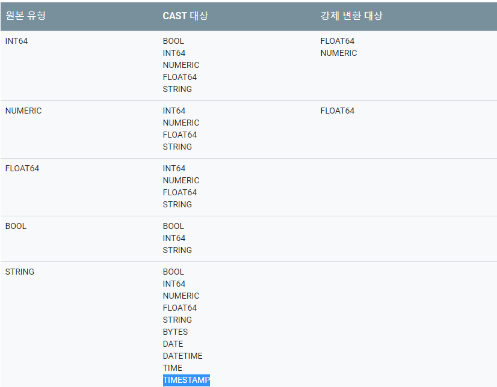

## 1. to-do
> - 시간을 표현하는 컬럼(string 타입)에서 시간만 추출 <br>
>   + ex) '2019-12-10 07:32:40:836' 에서 시간을 표현하는 07 만 가져오기

## 2. 문제 발생
> - 가이드대로 extract(hour from cast('2019-12-10 07:32:40:836' as timestamp)) 호출하였으나 실패
>   + 에러 내용) Invalid timestamp: '2019-12-10 07:32:40:836'<br>
>   + 문제 분석)
>       * string 은 [bigquery 변환 규칙](https://cloud.google.com/bigquery/docs/reference/standard-sql/conversion_rules?hl=ko)에 따르면 timestamp 로 변환이 가능하다<br>
<br>
>       * 그럼에도 불구하고 위 쿼리에서 에러가 발생한 이유는 string expression 이 timestamp literal 과 일치하지 않기 때문
>       * timestamp literal 에 맞게 변환해줘야 함 <br>
>       * 문제가 되는건 초(40)와 밀리초(836) 사이의 문자가 '.' 이 아니라 ':' 로 되어 있기 때문....[date time literal](https://cloud.google.com/bigquery/docs/reference/standard-sql/lexical?hl=ko#datetime-literals) <br>
>   + 해결 방안)
>       * 초 단위와 밀리초 단위 사이의 문자 :(콜론) 을 ,(콤마) 로 변환
>       * 변환된 string 을 timestamp 로 변환(cast) 하고 hour 를 extract

## 3. 해결 시도
> - REGEXP_REPLACE([link](https://cloud.google.com/bigquery/docs/reference/standard-sql/string_functions?hl=ko#regexp_replace))
>   + 정규 표현식과 일치하는 문자열을 변경하는 함수
> - REGEXP_REPLACE 를 사용하려다가 생각의 흐름
>   + 그런데 정규 표현식을 쓰려면 정규표현식을 배워야 함(난 editplus 에 종속되어 있어서.. bigquery 정규표현식은 또 찾아봐야 함...)<br>
>   + BigQuery 가 제공하는 함수 중 REGEXP_EXTRACT 함수와 SUBSTR 함수가 눈에 들어 옴<br>
>   + 제공받은 데이터는 자리수가 모두 맞춰져 있기 때문에 정규표현식을 사용할 필요가 없는 SUBSTR([link](https://cloud.google.com/bigquery/docs/reference/standard-sql/string_functions?hl=ko#substr)) 을 사용하기로 결정...<br> 
> - SUBSTR
>   + SUBSTR 을 사용하는 방법은 간단하다. 다른 언어에서 사용하던 substr 함수와 매우 유사<br>
>   + 문자열 중에서 내가 원하는 문자열의 position 과 length 만 지정해주면 전체 문자열 중 원하는 문자열(여기서 우리가 원하는건 "시간"에 해당하는 문자열)을 가져온다.<br>
>   + 최종 query 는 아래와 같다
```sql
SELECT SUBSTR('2019-12-10 07:32:40.836', 12, 2) as hh
```
>   + 본인의 프로젝트에 적용하려면 문자열 부분을 컬럼명으로만 바꿔주면 됨<br>

## 4. 마무리
> - 운 좋게(?) 내가 갖고 있는 시간 표현 string 의 자리수가 항상 같기 때문에 사용 가능한 방법<br>
> - 다른 경우라면 위에서 언급한 REGEXP_REPLACE 나 REGEXP_EXTRACT 함수를 사용해야 할 것<br>
> - 평소에 bigquery 쓸 일 없는데 급하게 필요해서 써 본 것이라서 심도 있는 쿼리는 아니다. 문제가 있거나 잘못된 점 있으면 지적은 언제든 환영<br>